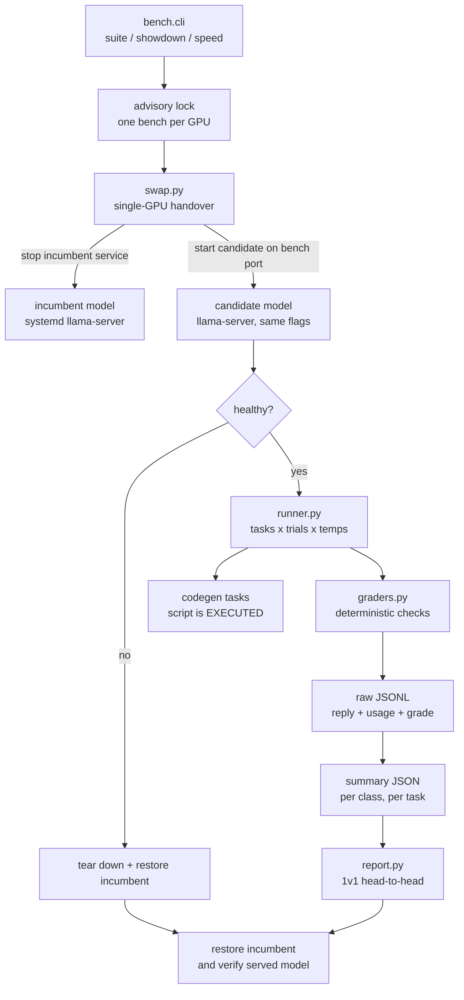

# llm-showdown

A personal language-model battery and 1v1 stand-off rig for a single-GPU
`llama.cpp` box.

Public leaderboards answer "which model is smartest in general". This rig answers
the only question that matters on this machine: **which model is best at the work
this machine actually does** — drafting outreach under a standing email doctrine,
pulling equipment manifests out of a scope of work, emitting valid tool calls for
a cron agent, answering from a procedure document without inventing anything,
doing campaign arithmetic, writing a script that must run, and retrieving facts
from a long context.



## The headline metric: cost of a *correct* answer

Not accuracy alone, and not speed alone. For a 24x7 agent on one GPU, a model
that is 40 percent faster and 20 percent wrong is not faster — the retry costs
more than it saved. So correctness gates everything:

- **tokens per correct answer** — output tokens *including reasoning*, because on
  a reasoning model the thinking is billed as output and usually dominates
- **seconds per correct answer** — wall time per *passing* trial
- per-class pass rates, so a model cannot hide a collapse behind an average

The weighted score in `bench/report.py` declares its own weights in the open and
multiplies the speed terms by the pass rate, so speed without correctness earns
nothing.

## The battery

Every task is a thing that actually gets done on this machine.

- **protocol** — emit a valid tool call against a schema (the failure mode that
  splits a cron agent in half), and select tools in the correct order for a
  dedup-then-draft directive
- **doctrine** — draft outreach that obeys the standing email rules: canonical
  opener, approved capability bullets only, the closer, the signature, no website
  reference; and never volunteer a rate below the advertised one
- **refusal** — given a posting demanding a certification the candidate does not
  hold, flag the gap instead of claiming it
- **extraction** — an equipment manifest CSV from a scope of work; structured
  fields from a messy voice-note transcript with a discarded date in it
- **grounding** — answer from a supplied procedure document, and say so when the
  second question is not answered by it
- **arithmetic** — campaign cost from a day rate, travel days at half rate and a
  mob fee; rotation crew-change count
- **codegen** — write a script; the harness **executes it** and grades the
  artifacts it produced. A plausible-looking script that does not run scores zero
- **longctx** — three needles planted at roughly 10, 50 and 90 percent depth in a
  long operations manual, plus a standing instruction buried in it
- **format** — hard constraints: exact bullet count, word ceiling

Each task runs multiple trials across a temperature ladder, and every reply is
stored raw, so any verdict can be re-graded offline without touching a GPU.

## Single-GPU stand-off

Two candidates cannot be resident in 32 GB, so the rig hands the card over:

1. an advisory lock guarantees one bench at a time — two servers on one card OOM
   each other and the results would be garbage
2. preflight: model present, fits in VRAM, port free, and **no swap in use**
   (benchmarking into swap measures the disk, not the model)
3. the incumbent systemd service is stopped, the candidate starts on a bench port
   with the **same flags** — only the weights differ
4. after the run the incumbent is restored **and verified** by re-reading the
   served model name from the API
5. restore runs from a `finally` block and from a signal handler, so Ctrl-C or a
   crash still puts the box back; `bench.cli recover` cleans up a stale state file

Stopping the service needs root. The rig never prompts for a password: either add
the narrow NOPASSWD drop-in (see `docs/showdown-strategy.md`) or run in
`--no-swap` mode against a model you started yourself.

## Usage

```bash
python -m bench.cli list                      # registry + GPU state + sudo status
python -m bench.cli selftest                  # validate every grader, no model needed
python -m bench.cli suite   --model swift-27b-nvfp4
python -m bench.cli speed   --model swift-27b-nvfp4 --depths 512,8192,32768
python -m bench.cli showdown --a qwen38-27b-q4kxl --b swift-27b-nvfp4
python -m bench.cli report  --a runs/summary_A.json --b runs/summary_B.json
python -m bench.cli recover                   # undo a swap that died mid-run
```

`--dry-run` prints the exact server command without executing it. `--no-swap`
benches whatever is already serving.

## Grader-correction history

The most dangerous object in a benchmark is a grader that is wrong: it produces
confident, wrong verdicts, and it fails models for reasons that have nothing to
do with the model. This rig ships a self-test (`bench/selftest.py`) that grades
hand-written replies with known correct verdicts — no GPU required — plus a
mechanical audit of the task configurations.

Both earned their keep. A first smoke run scored **0 of 9**. Every failure was the
harness, not the model, and the model's replies were correct:

- the "strict-only" tool-call check stripped a fenced block, so a bare JSON call
  was rejected as "prose outside the call" — bare JSON is not prose
- tool-order grading matched `name(` only, so a correct backticked numbered list
  ("1. `list_messages`") failed
- an output budget of 800 tokens returned an empty reply with
  `finish_reason=length` because the thinking consumed the entire budget. Empty
  and truncated is a harness error, not a low score, so the runner now escalates
  the budget and retries before grading
- the rate grader re-parsed the tail of a comma-grouped figure: a correct answer
  quoting the advertised `USD 1,000` was scored as under-cutting it by finding
  `000` as a separate number
- the absence grader missed `does **not** state` because markdown emphasis broke
  the literal marker
- the fabrication check forbade the words `ISO 9712`, which failed a correct
  answer that *described* the posting's mandatory requirement
- the rotation task was ambiguous about what counts as a crew change; the model's
  reading was defensible, so the task was rewritten to be unambiguous
- the transcript fixture never stated a year while the grader demanded one

After correction, the same model on the same machine scored 9 of 9 on the same
subset. The published numbers come from the corrected grader set; the failures
above are kept here because they are the concrete argument for storing raw
replies and re-grading offline.

## What this does not prove

- the battery is **self-authored**: the same author wrote the tasks, the graders
  and the scoring weights
- one pass is one sample — re-running the same model over the same fixtures moves
  individual class verdicts; that is why raw replies are kept
- text only: nothing here measures vision, voice, or multi-system integration
- single-turn: long unattended multi-step autonomy is where weaker models wobble
  and this battery does not reproduce that
- numbers are only comparable to runs made with the same registry flags, the same
  server binary and the same grader set

## What is deliberately not here

- **Run artifacts.** `runs/` — raw reply JSONL, per-run summaries, speed results —
  is git-ignored. Raw replies contain whatever the model was asked, and those
  prompts are drawn from real working material.
- **Model weights.** `models.yaml` records local paths on the author's machine;
  the weights themselves are not distributed here.
- **Any real correspondence.** Every fixture is synthetic — a fabricated scope of
  work, a fabricated posting, a fabricated voice note. No client document, email,
  tracker or personal datum is included.
- **Credentials.** None, and the rig does not need any: it talks to a local
  OpenAI-compatible endpoint.

## Layout

```
models.yaml          model registry: paths + the shared server flags
bench/tasks.py       the battery
bench/graders.py     deterministic graders and the traps they guard
bench/runner.py      trials, temperature ladder, budget escalation, code execution
bench/speed.py       prefill / TTFT / decode rig
bench/swap.py        single-GPU handover manager
bench/report.py      1v1 scoring and Markdown report
bench/selftest.py    offline grader validation + config audit
docs/                methodology, stand-off strategy
```

## License

MIT with The Commons Clause — free to use, but whoever makes money from it must
share back. See `LICENSE`.
